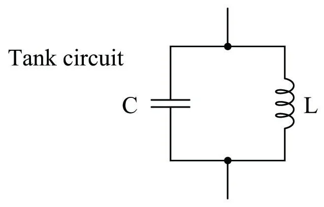
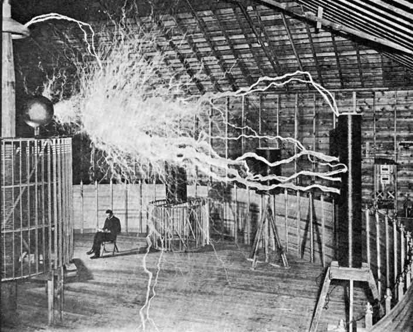
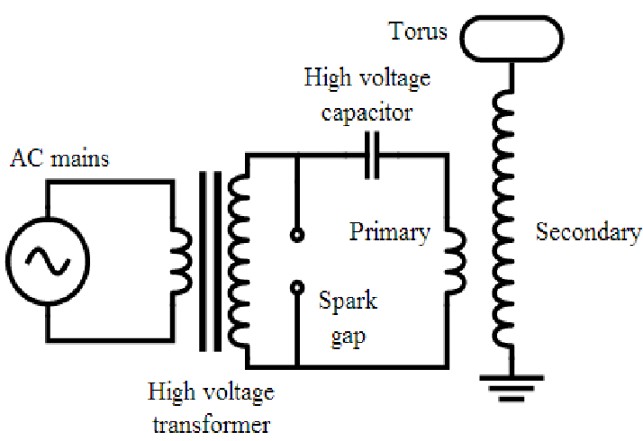
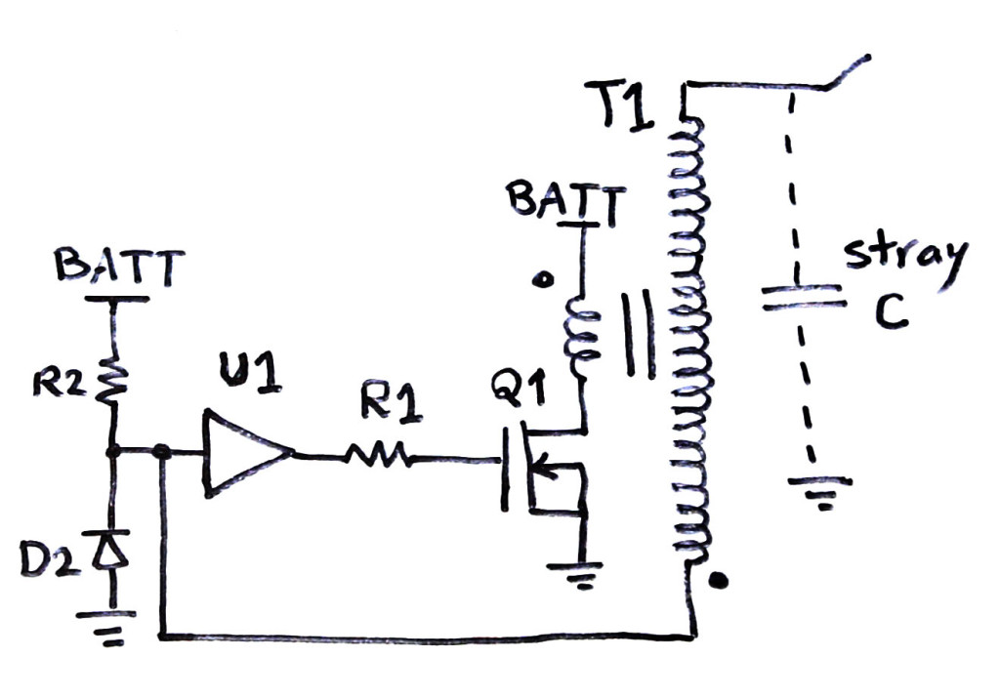

무선 전류 전송 기술에 대한 여러 실험
=========================
by 정연호, 하성욱
-------------------------

## 0. 목차
___
 1. 무전기
	 1. 정의
	 2. 용어
	 3. 제작 과정

 2. 테슬라 코일
	1. 정의
	2. 제작 과정

3.  정리

## 1. 무전기
___
### 1.1. 정의
___
#### 1.1.1 무전기란?
<pre><code> 별도의 기지국 없이 전파에 의해 음성 신호를 송신하고 수신하는 장치. 
특정한 주파수를 사용해 무선통신을 할 수 있으며, 
한 사람의 말을 여러 사람이 동시에 들을 수도 있다.</code></pre>

#### 1.1.2 무전기의 간략한 원리
<pre> 무전기는 방송국과 라디오가 하나로 들어가 있는 장치라고 볼 수 있다. 
무전기의 송수신 원리는 음성 신호를 전파로 바꿔 각 주파수에 실어 보내고, 
다른 한쪽에서는 그 전파를 받아 다시 음성 신호로 바꿔 상대방이 들을 수 있도록 한 것. 

 휴대폰을 사용하지 못하는 곳에서도 무전기는 통화가 가능한 이유는 이것 때문. 
(휴대폰 통신이 안되는 이유는, 전화 신호는 기지국을 거쳐서 가야 하는데, 
특정 장소에서 기지국까지 전파가 닿지 않는 경우기 있기 때문임. 원리는 동일) 

 무전기 사용 시 수많은 전파 중 혼선 없이 원하는 전파만을 주고받기 위해 주파수를 사용. 
무전기의 종류와는 상관없이 주파수만 일치하면 통신이 가능하고 다수가 교신 가능함. </pre>

### 1.2. 용어
___
#### 1.2.1 주파수
<pre>주파수란 1초에 ~~한 주기를~~ 진동하는 횟수.
무전기는 100MHz, 200MHz, 400MHz 등 다양한 주파수의 무전기가 있다.
100MHz ,200MHz 는 1파장의 길이가 3m, 1.5m라 길지만, 손실이 많이 일어나 도심에서는 사용하기 어렵고, 400MHz 의 경우 70cm 정도로 손실을 최소화하여 도심에서 사용하기 좋으나 넓은 곳에선 적합하지 않다. (회절 손실)
</pre>
___
###### 1.2.1.1 회절손실과 프레넬 존

<pre>**회절**
 전파의 특성 중 하나로, 전파의 파정보다 넓은─투과 불가능한 물체의 가장자리에서 발생한다. 
 회절은 파장이 짧을 수록 약하고, 직진성이 강하다.
 
**프레넬 존**

????- 전계강도가 장애물의 영향을 받아 변화하는 영역
????
????- 전파가 전력의 감쇠 없이 송신기에서 수신기에 도달하기 위해서는, 
????  일정 크기의 공간이 필요하다.
????  
? ? - 필요한 공간은 안테나 사이의 최단 거리를 따라 형성되는 타원체이며, 
? ?   이것을 프레넬존이라고 한다.
? ?   
? ? -?프레넬존 내부에 장애요소가 있는 경우(전파통로와 장애물 사이 장애물이 가리지 않아도) 
? ? ? 직접파와 회절파의 간섭에 의해?수신 전계 강도가 약화될 수 있으며?수신 감도가 약한 경우, 
? ? ? 오류가 발생할 확률이 점차 증가한다.

</pre>
#### 1.2.2 FM과 AM
___
###### AM은 Amplitude Modulation Broadcasting(진폭 변조 방송)

1. 진폭 변경으로 일정하지 않은 진폭
2. 먼 곳에서 수신 가능(약한 신호는 못 잡을 수도) 왜일까?
3. 다른 신호에 의한 방해 (수도권은 북한의 전파방해 때문에 AM의 음질이 좋지 않음)

###### FM은 Frequency Modulation Broadcasting(주파수 변조 방송)

1. 일정한 진폭에서 주파수를 변경(비교적 음질 좋음)
2. AM 보다 신호 간섭 적음
3. 물리적 장벽의 영향 받음(터널, 지하 등에서는 잘 안 잡힐수도)

#### 1.2.3 LC 발진기
___
 정확한 주파수에서 연속 주기적인 파형을 생성하는 전자 회로. 전류는 자기장의 _**변화**_ 로부터 생성되기 때문에, 일정한 전류─일정한 자기장으로는 전류를 생성해내지 못한다. 즉, 전기신호를 전달할 수도, 받을 수도 없다.

### 1.3. 제작 과정
___

###### 2022.05.04 주제를 무전기로, 직접 회로를 설계하기로 결정

###### 2022.05.08 회로 설계 완료

LC 발진기를 이용하여 교류를 생성한다. 교류 주파수는 다음 식을 통해 계산한다.
$$f = {1 \over {2 \times \pi \times \sqrt{L \times C}}}$$
FM라디오의 방송 대역은 전 세계적으로 초단파인 **87.5 ~ 108.0 MHz**사이에서 사용되고 있다.
**100.0 MHz** 신호를 만들기 위해 **C= 30pF**의 콘덴서를 사용했다. 

**인덕터(=L)** 는 시중에 원하는 용량의 것이 판매하고 있지 않았기 때문에, 재활용장에 있는 구리선을 이용하여 Air coil을 직접 제작하였다. Air coil의 인덕턴스는 다음 식으로 계산한다.
$$L = {{N^2 \times R^2} \over 9R + 10H}$$
$$N = 감은 횟수,   R = 반지름,   H = 코일의 높이$$

이후 제작 과정에서 뼈저리게 느끼지만, 아주 약간의 높이 차이, 간격 차이로도 L의 값이 변화했기 때문에, 주파수를 정확하게 맞추는 것이 매우 어려웠다. 

약간의 흔들림으로 주파수가 변했기 때문에, 완성 이후에도 장시간 무전하는 것이 힘들었다. 이는 
이후 정연호가 SDR(Software Defined Radio)에 관심을 가지는 이유가 되기도 한다. SDR은 실시간으로 주파수를 시각화하여 볼 수 있기 때문에, 라디오의 다이얼을 열심히 돌리지 않아도 어느 주파수에서 신호가 나오는 지 확인할 수 있다.

FM신호는 밑 이미지와 같이 기준 주파수에서 변조를 가하여 신호를 전달한다. (주파수 변조)
  

 설계한 회로에서는 콘덴서 마이크에서 생성되는 전류를 NPN 트랜지스터(BC548)을 통해 증폭하고, 생성되는 교류의 주파수를 조절하여 FM 신호를 만들어낸다.

###### 2022.05.12 무전기 1호 제작 완료

설계한 회로대로 부품을 시켜 무전기의 송신부(fm transmitter)를 제작했다. 완성한 이후에도 약 일주일동안 라디오의 다이얼을 돌리며 무전기에서 발생되는 신호를 찾아다녔다.

###### 2022.05.20 장거리 송신 테스트

다음과 같이 안테나를 제작하여, 좋아하는 음악을 틀어보고, 집 밖으로 나와 테스트를 진행했다.

집 밖에서도 노래는 하나의 노이즈 없이 잘 들렸다. (휴대용 라디오), 

지도로 측정해본 결과, 가운데 장애물이 있음에도 약 100m 안쪽으로는 작은 라디오로도 신호를 잡을 수 있었다. 100m를 벗어날 경우에는 신호가 약해서 잡지 못하거나, 방송국 신호가 들어왔다.

사실 이 순간 굉장히 무서웠는데, 그 이유는 미국 등의 다른 국가와 우리나라의 통신법이 다를 수도 있다는 것을 깨달았기 때문이다.

우리나라에서는 FM 라디오 주파수 대역의 이용에 허가가 필요하다. 내가 사용한 100.0 MHz주파수 대역은 당연히도 FM 라디오 대역이다. 

다행이도, 제작한 무전기의 출력은 1W도 되지 않은 소출력이었기 때문에, 주변에 피해도 없을 뿐더러, 적발할 방법도 없다. 
이후 실험은 안테나를 사용하지 않고, 소출력으로 작동시켰다. (대략 10m 반경)

___
___

## 2. 테슬라 코일
___
### 2.1. 정의
___
#### 2.1.1 소개

 테슬라 코일은 1891년 니콜라 테슬라가 설계한 전기 공진 변압기 회로이다. 고전압, 저전류, 고주파 교류 전기를 생산하는 데 사용된다. 테슬라는 이 회로를 이용해 전기 조명, 인광, X선 발생, 고주파 교류 현상, 전기 치료, _**전선 없이 전기 에너지를 전달하는 혁신적인 실험**_ 을 진행했다

이는 겉보기에 정말 멋있어 보이나, 사실 **효율이 매우 안 좋은 변압기**이기도 하다. 변압기는 전류로 자기장을 발생시키고, 발생된 자기장을 다시 전류로 바꾸면서 _전압_ 을 바꾸는 장치이다.

때문에, 중간 과정에서 발생하는 자기장을 온전히 다시 전류로 바꾸어줄 수록 효율이 높아지는데, 이를 위해 변압기의 중심에 코어(자기장을 모아서 집중시켜줌)를 사용한다. (전류를 자기장으로 바꾸기 위해선 전선을 원형으로 감은 **코일** 을 이용한다.)

그러나 테슬라 코일은 이런 코어를 사용하지 않는다. 대신, 자기 공명을 사용한다. 이는 현재 휴대폰 무선 충전의 일종으로 응용되는 기술이기도 하다.

앞선 무전기 제작 과정에서 배운 LC 발진기, 그리고 주파수를 계산하는 식을 통해 자기 공명에 사용되는 주파수를 계산할 수 있다. 테슬라 코일을 이루는 각 코일(테슬라 코일은 1차 코일과 2차 코일로 구성됨)의 인덕턴스(=L)과 커패시턴스(=C)로 1차 코일과 2차 코일의 주파수를 동일하게 맞추면 공명이 발생한다.

#### 2.1.2 종류
___
###### 1. SGTC
 Spark Gap Tesla Coil의 약자로, 커패시터를 이용한 Voltage doubler를 응용하여 1차 코일에 전류를 전송한다. 여기에 스파크 갭(전류를 흘려보내는 스위치 역할)이 사용되기 때문에, SGTC라는 이름이다. 니콜라 테슬라가 제작한 테슬라 코일이다.
 

###### 2. SSTC
 Solid State Tesla Coil의 약자로, 현대의 soild state=반도체를 이용한 것으로, 스파크 갭이 없어(엄청나게 시끄러운 소리를 낸다) 조용하고, 주파수의 변조도 용이하여 이를 통해 스피커처럼 사용할 수도 있다. (음악은 공기의 진동으로, 특정한 주기의 discharge(방전)을 통해 발생되는 공기 진동을 소리로 인식한다. 참조-인간의 가청 주파수는 20 Hz ~ 20,000 Hz)

### 2.2. 제작 과정
___
제작 난이도는 SGTC가 쉽지만, 비용이 만만치 않게 들었기 때문에, 처음에는 SSTC를 제작하기로 했다.

##### 2022.07.23 계획 수립
0. 형광등 켜기
1. 스파크 보기
2. 불 붙이기
3. 음악 듣기
4. x cm 스파크 달성 (x >= 10)

0번 부터 4번까지 쉬운 순으로 목표를 정렬하였다.

###### 2022.07.29 1차 제작 모임
우선 SSTC중 가장 간단한 Slayer exciter 회로를 이번에도 NPN 트랜지스터를 이용하여 제작하였다.
(참고 영상 https://www.youtube.com/watch?v=AehL3BodduE)

2차 코일(Secondary Coil)은 높은 권선 수를 요구하기 때문에, 제작 시간의 상당분을 코일을 감는 것에 소모했다. 정연호는 휴지심에, 하성욱은 프링글스 과자 통(붉은색 큰 통)에 0.3mm의 구리선을 감았다.

https://user-images.githubusercontent.com/44233195/184552717-79be7934-8b71-453e-a015-4d5f5796fdc6.mp4

배달 온 구리선을 풀어보았는데, 처음부터 엉켜 있어서 이것을 푸는데 3시간 정도 소요했다. (결국 못 풀어서 그냥 잘라버렸다.)

<1차 시도 with 프링글스 코일>

https://user-images.githubusercontent.com/44233195/184552724-0437c0c8-b151-4658-bced-2efd7c52fa11.mp4

영상에서 볼 수 있는 것처럼, 첫 기도는 처참하게 실패했다. 거의 4시간에 걸쳐 제작한 코일은 작동하지 않았다.

<2차 시도 with 휴지심 코일>

https://user-images.githubusercontent.com/44233195/184552949-3540fa4a-f07c-4dde-8f0e-b4b4e1858648.mp4

형광등을 키는 것에 성공했다. (0번 목표 달성)

형광등이 켜지는 이유는 테슬라 코일로 발생되는 고전압에 의해 전자들이 Corona discharge(코로나 방전, 코로나 바이러스 아님)되며 공기중으로 날아가고, 주변에 있는 형광등을 통해 바닥으로 흐르기 때문이다.
(전기는 항상 전위가 낮은 곳으로(바닥, 저항이 낮은 곳으로(형광등) 흐르기 때문)

이후에도 프링글스 통을 이용한 실험은 수십 차례 진행했지만, 아무런 반응이 없었다.

   
   
   
   

###### 2022.08.02 2차 제작 모임

<코일을 열심히 감고 있는 모습. 영상에서는 하성욱만이 일하고 있는 것 같지만, 뒤에서 정연호는 회로 납땜을 하고 있다.>

https://user-images.githubusercontent.com/44233195/184552977-818f32b0-68a1-48cf-9987-ebca10f94826.mp4

두번째도 Slayer excitor 회로에 기반하여 실험하였다. 그러나 이번에 사용한 것은 트랜지스터가 아닌 모스펫(Mosfet)이다. 

모스펫은 전류를 증폭시키는 트랜지스터와 달리, 일정 전압을 가하면 통로가 열리는 스위치 역할을 하는 부품으로, 손쉽게 높은 출력을 제어할 수 있지만, 상대적으로 고가이며 쉽게 망가져버린다. 실제로 회로에 사용한 모스펫은 30초도 버티지 못하고 망가졌다.

(이미지 https://www.electroboom.com)

실험은 성공했다. 소비 전력은 1차 모임 대비 (20W) 5배 증가한 100W 출력을 보여주었다.(더 강함) 일반 백열전구도 예쁘게 켜지는 모습을 볼 수 있다.

https://user-images.githubusercontent.com/44233195/184552776-ec1d169d-6c97-4f87-bd84-f3e98ab82847.mp4

(1, 2번 목표 달성)

###### ~2022.08.15 SGTC 제작하기.
과장 없이 200번은 넘게 시도한 것 같다. 결론부터 말하면, 이것은 **기간 내에** 제작하는 것에 실패했다. 자율 마감일까지도 제작했으나, 카메라에 성공 장면을 담지 못 했다.

SGTC는 밑 그림처럼 작동하며, 비교적 간결한 디자인으로 제작 난이도 자체는 어렵지 않다.
!

실험 영상 중 하나. 스파크 갭의 소음은 역시 엄청나게 컸다. 

https://user-images.githubusercontent.com/44233195/184553022-11caa067-4c47-4f61-bcb2-e0103ef019fe.mp4

실패 원인 중 하나는, 고전압 고용량의 커패시터를 구매하는 것에 비용이 많이 들었기 때문에 자작으로 만들었으나, 자작품의 품질이 좋지 못해서였던 것 같다.

만들어본 커패시터로는 Flat Plate형식과 라이덴병 형식이 있으며, 라이덴 병은 음료수병, 소주병 등 온갖 물건으로 여러번 제작해보았다.

36000V 고전압에 견디지 못하고 구멍이 나버렸다.

https://user-images.githubusercontent.com/44233195/184552808-b927b081-c761-4a19-8eb8-328e7cef347d.mp4

https://user-images.githubusercontent.com/44233195/184552811-16891615-b1ec-4bf1-ba83-6685cefda1ef.mp4

## 3. 정리
___
>무전기- 무선 전류 전송 기술 프로젝트의 일환으로, LC 발진기와 트랜지스터를 이용하여 마이크의 신호를 증폭, 변조하고, 공기 중으로 전송하는 회로를 설계, 제작함. 전파 통신에서의 회절 손실과 프레넬 존의 개념을 학습함. 제작한 휴대용 FM 송신기가 100m 거리에서 정상적으로 작동하는 것을 확인함. 자기만의 라디오 방송국을 만듦.

> 테슬라코일- 무선 전류 전송 기술 프로젝트의 일환으로, 공명을 이용한 변압기인 테슬라코일을 반도체의 일종인 모스펫을 이용하여 제작하고, 형광등과 백열전구를 무선으로 켜는 것에 성공함. 스파크 갭을 이용한 테슬라코일도 제작에 도전했지만, 실험 성공 전에 방학이 끝나버림.

